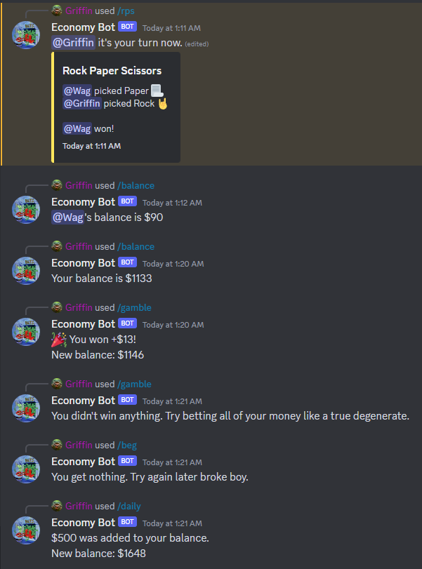

# About

Economy Bot (I'll make a more creative name eventually) is a Discord bot I made for my friends to use in our server. Currently implemented features include:

- Daily - Ability to claim a daily reward
- Beg - Ability to beg for a chance of recieving a random amount of money
- Gamble - Ability to gamble money with chances to make more
- Balance - Ability to check your own balance or another users

## Future Features

Some future features I'd like to add include:

- Leaderboard - Ability to see the top 5 ranking members in the server in descending order of amount of money
- Counter Strike case simulator - Ability to spend money and open simulated Counter Strike cases
- Inventory - Ability to claim skin from opened cases and add it to inventory
- Selling - Ability to sell owned skins recieved from crates

## Installation

Download the source code and run npm install to install the neccessary packages, and then run node index.js in your command line to host the bot locally.

You will need to create a .env file with a discord bot token and a mongodb uri for it to function.

or if you just want to include it in a server to try out [Bot Link](https://discord.com/api/oauth2/authorize?client_id=1170477091897229332&permissions=8&scope=applications.commands%20bot)
